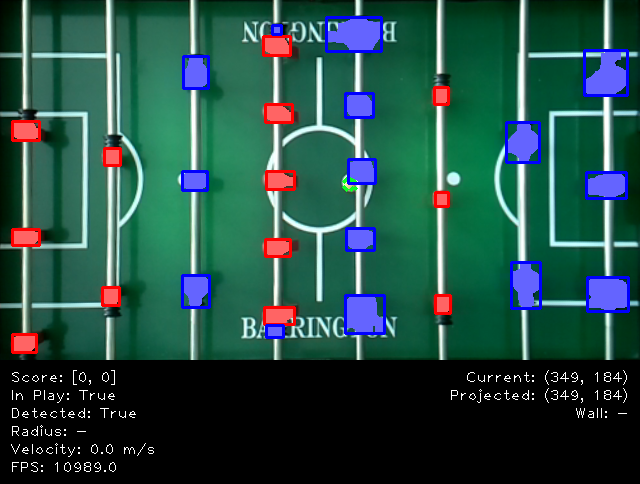

## Background
Every year, I accept an annual "challenge" of some kind. In past years, this has been anything from running a marathon (2007) or half ironman (2010) to a food challenge (2012) or even trying out for American Ninja Warrior (2018). According to StrengthsFinder, "learner" is my #1 strength, so the goal is to continually push myself into new areas that I'm less familiar with so that I continue to expand my horizons and grow as a leader.

This year (2020), I've accepted the challenge to build an Automated Foosball Table. This will allow me to gain working knowledge of Python, OpenCV, Artificial Intelligence (AI), and Machine Learning (ML), as well as brush up on other areas including robotics, physics, mechanical engineering, and programming. As an added benefit, it will also allow my oldest daughter (6 yr) to be able to play foosball any time she wants, even when I'm not available.

The end goal is to complete a working prototype of a foosball table that is capable of beating a human at the game of foosball by midnight on Dec 31, 2020.


## Setup
The basic setup will be a foosball table and a camera connected to a Raspberry Pi. This will allow for image detection to be able to detect the position and velocity of the foosball in real time. This information will be fed into the main script, which will be running 24/7 and will allow the Raspberry Pi to control linear and rotary motors that are connected to the rods on one side of the foosball table.




## Strategy
Regarding strategy, part of the program will need to determine how to respond based on the current conditions of the game. This requires the following assumptions:

```
* The computer can detect and track the table, foosball, and players at all times.
* The computer is able to move both motors (linear and rotational) on all 4 rows simultaneously.
* The foosball can be controlled by, at most, one row at a time.
```

Assuming these 3 conditions are met, the Automated Foosball Table will attempt a DEFENSIVE strategy first, followed by an OFFENSIVE strategy, followed by a HOLDING pattern.

A detailed version of the strategy can be found [here](media/strategy.pdf).
