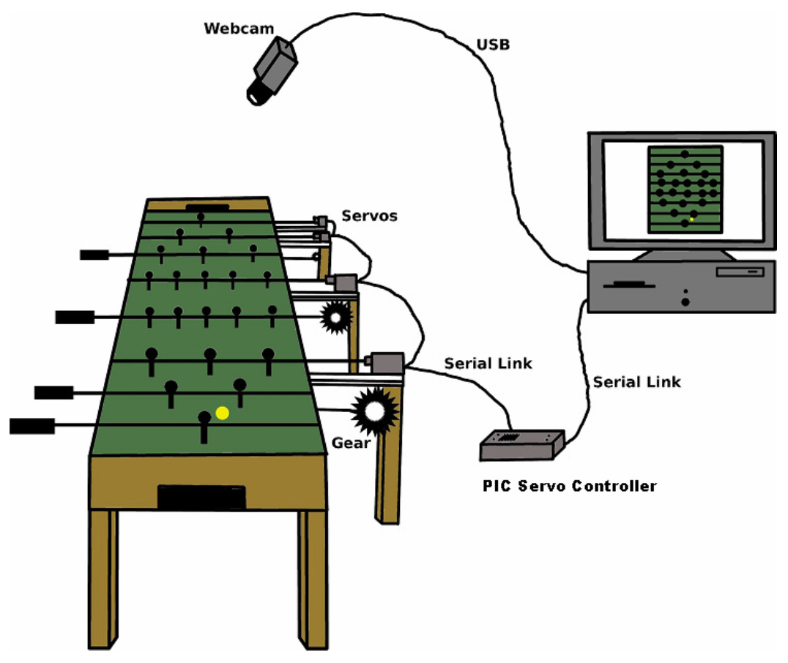
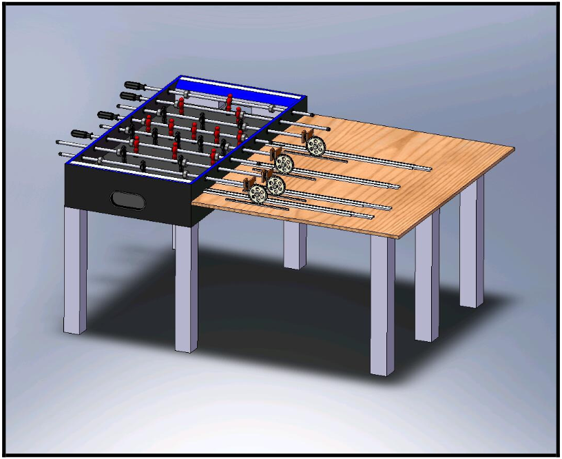

## Background
Every year, I accept an annual challenge. In past years, this has been anything from learning to juggle (2003) to running the [Disney Marathon](https://www.wdwmagic.com/events/walt-disney-world-marathon.htm) (2007) or [Half Ironman](https://www.ironman.com/im703-races) (2010), to the [Buffalo Wild Wings' Blazin' Challenge](https://www.buffalowildwings.com/en/food/sauces/blazin-side-of-sauce/) (2012), or even trying out for [American Ninja Warrior](https://www.nbc.com/american-ninja-warrior) (2018). I'm a problem solver by nature, so the goal is to continually push myself into new areas so I can continue to learn and grow.

For 2020, I accepted the challenge to build an automated foosball table. Imagine a normal game of [foosball](https://en.wikipedia.org/wiki/Table_football), except your opponent is a computer. I accepted this challenge because it will allow me to gain working knowledge of Python, OpenCV (computer vision), and Artificial Intelligence (AI). In addition, it will expand my knowledge in other areas including robotics, physics, and mechanical engineering. The end goal is to complete a working prototype of a foosball table that is capable of beating a human at the game of foosball by midnight on Dec 31, 2020.


## Setup
The basic setup will be a foosball table and a camera connected to a [Raspberry Pi](https://www.raspberrypi.org/). This will allow for image detection to be able to detect and track the position of the table, foosball, and players at all times.



Because the table can move slightly during game play, we account for this by placing [ArUco markers](https://docs.opencv.org/master/d9/d6d/tutorial_table_of_content_aruco.html) in each of the four corners of the table to identify and crop each image captured to the table boundaries. An example of an ArUco marker is below:


To detect the foosball and the players, we convert each cropped image into the [HSV color space](https://en.wikipedia.org/wiki/HSL_and_HSV) and then use native functions within OpenCV to create a mask using only the pixels within a certain HSV range. We then perform additional morphological operations to remove small blobs in the mask, yet preserve the shape and size of larger objects in the image.

This information will serve as input to the main script. Because the main script processes every frame in real time, we are also able to output a "preview" of what the computer sees:


All of this information is fed into the AI portion of the script, which is responsible for the overall strategy and determine what motion needs to occur. This information is translated into motor movement, and specific commands are sent to each of the eight motors in order to move the players.




## Strategy
Part of the challenge requires determining how the main AI script should respond, based on the current conditions of the game. This requires the following 3 assumptions:

```
- The computer can detect and track the table, foosball, and players at all times.
- The computer is able to move both motors (linear and rotational) on all 4 rows simultaneously.
- The foosball can be controlled by, at most, one row at a time.
```

Assuming these 3 assumptions are met, the main AI script will first attempt a DEFENSIVE posture, followed by an OFFENSIVE posture, followed by a HOLDING pattern.

A more detailed version of this strategy can be found [here](media/strategy.pdf).
