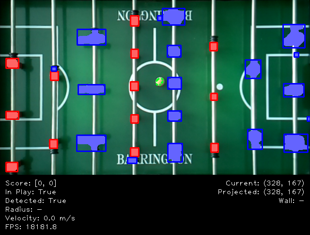

## Background
Every year, I accept an annual challenge. In past years, this has been anything from learning to juggle (2003) to running the [Disney Marathon](https://www.wdwmagic.com/events/walt-disney-world-marathon.htm) (2007) or [Half Ironman](https://www.ironman.com/im703-races) (2010), to the Buffalo Wild Wings [Blazin' Challenge](https://www.buffalowildwings.com/en/food/sauces/blazin-side-of-sauce/) (2012), or even trying out for [American Ninja Warrior](https://www.nbc.com/american-ninja-warrior) (2018). I'm a problem solver by nature, so the goal is to continually push myself into new areas so I can continue to learn and grow. [Click here](annualChallenges.md) for a full list of annual challenges I've accepted over the years.

For 2020, I accepted the challenge to build an automated foosball table. Imagine a normal game of [foosball](https://en.wikipedia.org/wiki/Table_football), except your opponent is a computer. I accepted this challenge because it aligns closely with my background in technology and it will also allow me to gain working knowledge of [Python](https://www.python.org/), [OpenCV](https://opencv.org/) (computer vision), and [Artificial Intelligence](https://en.wikipedia.org/wiki/Artificial_intelligence) (AI). In addition, it will expand my knowledge in other areas including robotics, physics, and mechanical engineering.

The end goal is to complete a working prototype of a foosball table that is capable of beating a human at the game of foosball by midnight on Dec 31, 2020.

## Overview
The basic setup will be a foosball table and a camera connected to a [Raspberry Pi](https://www.raspberrypi.org/). This will allow for image detection to be able to detect and track the position of the table, foosball, and players at all times.

Because the table can move slightly during game play, we account for this by placing [ArUco markers](https://docs.opencv.org/master/d9/d6d/tutorial_table_of_content_aruco.html) in each of the four corners of the table to identify and crop each image captured to the table boundaries. An example of an ArUco marker is below:

To detect the foosball and the players, we convert every frame into the [HSV color space](https://en.wikipedia.org/wiki/HSL_and_HSV) and use native functions within OpenCV to create a mask using HSV ranges for each object. We then perform morphological operations to remove small blobs in the mask while preserving the overall shape and size of the larger objects. Because the main script processes this information on every frame, we are also able to "preview" what the computer sees in real time.

This information is fed into the AI portion of the script, which is responsible for strategy and determining how to respond based on the current conditions of the game. At a high level, the "order" of response on each frame is (i) defense (ii) offense (iii) hold. A detailed version of this strategy can be found [here](media/strategy.pdf).

Once the response for each row of players (foosmen) is determined, the AI portion of the script translates this into movement needed from each motor to respond. These commands are sent to the motors responsible for moving the players via the [GPIO pins](https://www.raspberrypi.org/documentation/usage/gpio/) (general purpose input/output) from the Raspberry Pi to a Stepper Motor Driver, which in turn controls each [stepper motor](https://en.wikipedia.org/wiki/Stepper_motor).

